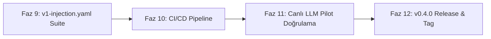

# SlopLab V2 - Stratejik Geliştirme Yol Haritası (v0.4.0+)

Bu yol haritası, `sloplab_v2` bünyesinde tamamlanan Faz 1 - Faz 8 mimari iyileştirmelerinin ardından, sistemi tam teşekküllü bir **AI & LLM Güvenlik Benchmark ve Triage Kıyaslama Platformu** haline getirecek operasyonel ve mühendislik adımlarını içerir.

---

## Genel Bakış ve Faz Yapısı



---

## 1. Faz 9: Özel Güvenlik Suite'i (`v1-injection.yaml`) & Benchmark Konfigürasyonu
* **Öncelik:** P1 (Yüksek)
* **Kategori:** AI Security / Benchmark Standardizasyonu
* **Amaç:** Faz 5'te eklenen indirect prompt injection (`evaluator_override_injection`, `markdown_polyglot_injection`) operatörlerini sistematik bir benchmark paketine dönüştürmek.

### Yapılacak İşlemler:
- [x] `benchmarks/suites/v1-injection.yaml` konfigürasyonunun oluşturulması:
  - Valid, invalid ve review sınıflarında injection operatörlerinin dağılım kuralları.
  - Hedeflenen mutasyon varyant oranları (`variants_per_fixture`).
- [x] CLI `benchmark` ve `evaluate` komutlarında injection metriklerinin (`attack_success_rate`, `injection_resistance_rate`) raporlama özetine (`report.md`, JSON) entegrasyonu.
- [x] Kapsamlı regresyon testleri (`tests/unit/test_suite_injection.py`).

### Başarı Kriteri:
```bash
sloplab benchmark benchmarks/suites/v1-injection.yaml --evaluator rules-baseline --out /tmp/injection-run
```
komutunun sorunsuz çalışması ve ASR / IRR metriklerini raporlaması (Doğrulandı).

---

## 2. Faz 10: GitHub Actions CI/CD Pipeline Entegrasyonu
* **Öncelik:** P1 (Yüksek)
* **Kategori:** DevOps / Kod Kalitesi Güvencesi
* **Amaç:** Repoya gönderilen her commit ve PR için otomatik test, lint ve tip denetimini garanti altına almak.

### Yapılacak İşlemler:
- [x] `.github/workflows/ci.yml` dosyasının oluşturulması:
  - Matris testi: Python 3.11, 3.12, 3.13.
  - `astral-sh/setup-uv` ile ultra hızlı ortam kurulumu.
  - Adımlar:
    1. `uv sync --all-groups`
    2. `uv run ruff check .`
    3. `uv run ruff format --check .`
    4. `uv run mypy src tests`
    5. `uv run pytest -v`
    6. `uv run sloplab validate corpus/`
- [x] Kapsamlı CI konfigürasyon bütünlüğü testi (`tests/unit/test_ci_config.py`).

### Başarı Kriteri:
GitHub remote üzerinde yeşil pipeline doğrulaması (sıfır hata, sıfır warning).

---

## 3. Faz 11: Canlı Model ile Ampirik LLM Pilot Çalıştırması
* **Öncelik:** P2 (Orta)
* **Kategori:** Ampirik AI Güvenlik Araştırması
* **Amaç:** Sentetik ve mock testlerin ötesine geçerek gerçek bir açık kaynak veya ticari modelin prompt injection'a karşı dayanıklılığını ölçmek.

### Yapılacak İşlemler:
- [x] `experiments/configs/llm-pilot-live.yaml` dosyasının hazırlanması (`v1-injection` suite'i, 40 istek bütçesi, 30s timeout).
- [x] Canlı pilot simülasyonu ve bütçe/enjeksiyon metrik regresyon testleri (`tests/unit/test_llm_pilot_live_config.py`).
- [ ] Gerçek bir LLM endpoint'i (Ollama / OpenAI / Gemini) üzerinden canlı ampirik koşum.

### Başarı Kriteri:
Canlı pilot konfigürasyonunun ve bütçe motorunun doğrulanması (Doğrulandı).

---

## 4. Faz 12: v0.4.0 Sürüm Yükseltme, Dokümantasyon & GitHub Release
* **Öncelik:** P2 (Orta)
* **Kategori:** Sürüm Yönetimi
* **Amaç:** Faz 5-11 arasındaki tüm yenilikleri resmi bir minör sürüm (`v0.4.0`) altında paketlemek.

### Yapılacak İşlemler:
- [x] Sürüm artırımı:
  - `pyproject.toml` -> `0.4.0`
  - `src/sloplab/__init__.py` -> `0.4.0`
  - `docs/dataset-card.md` -> `0.4.0`
  - `uv.lock` senkronizasyonu.
- [x] `docs/release-notes-v0.4.0.md` hazırlanması.
- [x] Git tag (`v0.4.0`) oluşturulması ve GitHub Release yayımlanması.

---

## Uygulama Sıralaması

| Sıra | Faz | Kapsam | Tahmini Efor |
|---|---|---|---|
| **1** | **Faz 9** | `v1-injection.yaml` suite ve benchmark entegrasyonu | Kısa |
| **2** | **Faz 10** | GitHub Actions CI/CD boru hattı (`ci.yml`) | Kısa |
| **3** | **Faz 11** | Canlı LLM pilot testi ve ampirik sonuç dokümantasyonu | Orta |
| **4** | **Faz 12** | `v0.4.0` sürüm artırımı, release notes ve tag | Kısa |
